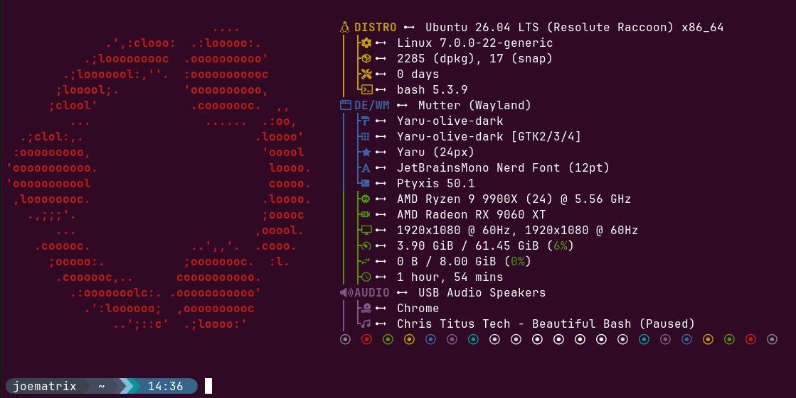

# ChrisTitusTech's `.bashrc` Configuration (patched fork)

> **Fork note:** This is a fork of [ChrisTitusTech/mybash](https://github.com/ChrisTitusTech/mybash)
> with a restored, fixed `setup.sh`. Upstream deleted `setup.sh`, and on modern
> distros the prompt/fastfetch icons showed up as blank boxes because the
> installer never told the terminal to use a Nerd Font. This fork fixes that and
> stops the installer from clobbering your existing `~/.bashrc`. See
> [What this fork fixes](#what-this-fork-fixes).

## Overview

This repository provides a comprehensive `.bashrc` configuration along with supporting scripts and configuration files to enhance your terminal experience in Unix-like operating systems. It configures the shell session by setting up aliases, defining functions, customizing the prompt, and more, significantly improving the terminal's usability and power.



*The result on Ubuntu 26.04 (Ptyxis): Starship prompt + fastfetch with a Nerd Font, icons rendering correctly.*

## Table of Contents

- [What this fork fixes](#what-this-fork-fixes)
- [Installation](#installation)
- [Switching color palettes](#switching-color-palettes)
- [Uninstallation](#uninstallation)
- [Configuration Files](#configuration-files)
  - [.bashrc](#bashrc)
  - [starship.toml](#starshiptoml)
  - [config.jsonc](#configjsonc)
- [Key Features](#key-features)
- [Advanced Functions](#advanced-functions)
- [System-Specific Configurations](#system-specific-configurations)
- [Conclusion](#conclusion)

## What this fork fixes

1. **The terminal font is actually configured.** Upstream installed a Nerd Font
   but never selected it, so icons rendered as blank boxes. This fork sets the
   font via `gsettings` for **Ptyxis** (Ubuntu 26.04+ default terminal) and
   **GNOME Terminal**.
2. **JetBrainsMono Nerd Font** instead of the cramped `Mono` Meslo variant, so
   glyphs render at a sensible width.
3. **Non-destructive bash merge.** Your existing `~/.bashrc` is backed up to
   `~/.bashrc.bak.<timestamp>`, then `~/.bashrc` becomes a small loader:

   ```sh
   [ -f ~/linuxtoolbox/mybash/.bashrc ] && . ~/linuxtoolbox/mybash/.bashrc
   [ -f ~/.bashrc_personal ] && . ~/.bashrc_personal
   ```

   Put your own settings in **`~/.bashrc_personal`** — it's sourced last, so it
   overrides mybash and survives re-runs and `git pull`s.
4. **Safer install:** refuses to run as root, and removes dangling symlinks
   before relinking (the failure mode that could leave a broken `~/.bashrc`).

## Installation

Run as your **normal user** (not with `sudo`):

```sh
git clone https://github.com/joematrix77/mybash_fix.git
cd mybash_fix
./setup.sh
```

Then **fully quit your terminal (close all windows) and reopen it** so the new
font and shell config take effect.

The `setup.sh` script automates the installation process by:

- Creating `~/linuxtoolbox/mybash` and cloning the repository there
- Installing dependencies (bash-completion, neovim, fastfetch, bat, etc.)
- Installing **JetBrainsMono Nerd Font**, Starship, fzf, and zoxide
- Merging `~/.bashrc` (loader + `~/.bashrc_personal`) and linking
  `starship.toml` and the fastfetch config
- **Setting your terminal font** to the Nerd Font (Ptyxis / GNOME Terminal)
- Installing the `starship-theme` palette switcher to `~/.local/bin`

Ensure you have a supported package manager and are in the `sudo` group.

## Switching color palettes

The prompt ships with the Nord theme (blue/teal), which reads as Arch/Nordic.
Use the bundled **`starship-theme`** command to recolor it to your distro — it
swaps only the 6 segment colors against a pristine base, so the Powerline
glyphs and layout are always preserved:

```bash
starship-theme            # interactive picker (fzf if available)
starship-theme ubuntu     # apply a palette directly
starship-theme list       # list available palettes
```

Starship re-reads its config every prompt, so the change shows on your next
prompt — no restart needed. Available palettes:

| Palette | Accent |
|---------|--------|
| `ubuntu`  | orange + aubergine |
| `claude`  | warm coral / clay |
| `arch`    | cyan |
| `fedora`  | Fedora blue |
| `debian`  | Debian red |
| `mint`    | Mint green |
| `manjaro` | Manjaro green |
| `popos`   | teal + orange |
| `nord`    | original theme (revert) |

It writes to `~/.config/starship.toml`. If that file is a symlink to the repo,
`starship-theme` replaces it with your own copy so your colors survive
`git pull`s.

## Uninstallation

To uninstall the `.bashrc` configuration, run:

```sh
cd mybash
chmod +x uninstall.sh
./uninstall.sh
```

The `uninstall.sh` script reverses the installation process by:

- Removing installed dependencies
- Uninstalling fonts
- Removing symbolic links to configuration files
- Deleting the `linuxtoolbox` directory
- Cleaning up additional utilities like `starship`, `fzf`, and `zoxide`

After running the script, it's recommended to restart your shell to apply the changes.

## Configuration Files

### `.bashrc`

The `.bashrc` file defines aliases, functions, and environment variables to enhance your shell experience. Key features include:

- **Aliases**: Shortcuts for common commands (e.g., `alias cp='cp -i'`)
- **Functions**: Custom functions for tasks like extracting archives and copying files with progress

### `starship.toml`

The `starship.toml` file configures the [Starship](https://starship.rs/) prompt, providing a highly customizable and informative shell prompt. It includes:

- **Theme Settings**: Defines colors and symbols for different prompt segments
- **Module Configurations**: Customizes modules like `python`, `git`, `docker_context`, and various programming languages
- **Format Customization**: Structures the layout and truncation of paths for a cleaner look

### `config.jsonc`

The `config.jsonc` file configures [fastfetch](https://github.com/AlexRogalskiy/fastfetch), a system information tool. It includes:

- **Logo and Display Settings**: Customizes the appearance of system logos and separators
- **Modules**: Defines which system information modules to display, such as CPU, GPU, OS, kernel, and uptime
- **Custom Sections**: Adds custom formatted sections for hardware and software information

## Key Features

1. **Aliases and Functions**
   - Shortcuts for common commands
   - Custom functions for complex operations (e.g., extracting archives, copying with progress)

2. **Prompt Customization and History Management**
   - Configures PROMPT_COMMAND for automatic history saving
   - Manages history file size and handles duplicates

3. **Enhancements and Utilities**
   - Improves command output readability with colors
   - Introduces safer file operations (e.g., using `trash` instead of `rm`)
   - Integrates Zoxide for easy directory navigation

4. **Installation and Configuration Helpers**
   - Auto-installs necessary utilities based on system type
   - Provides functions to edit important configuration files

## Advanced Functions

- System information display
- Networking utilities (e.g., IP address checks)
- Resource monitoring tools

## System-Specific Configurations

- Editor settings (NeoVim as default)
- Conditional aliases based on system type
- Package manager-specific commands

## Conclusion

This `.bashrc` configuration offers a powerful and customizable terminal environment suitable for various Unix-like systems. It enhances productivity through smart aliases, functions, and integrated tools while maintaining flexibility for system-specific needs. Whether you're a developer, system administrator, or power user, this setup aims to make your terminal experience more efficient and enjoyable.

For any issues, suggestions, or contributions, please open an issue or pull request in this repository. We welcome community involvement to make this configuration even better!